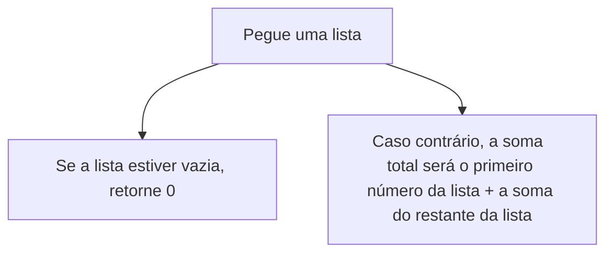
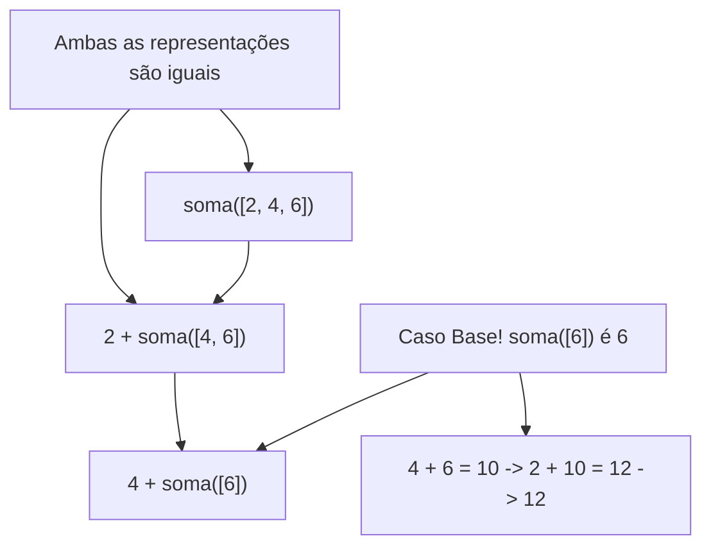

# Capítulo 04

# Dividir para Conquistar (DC)

Técnica “Dividir para conquistar (DC)” é uma técnica recursiva. Assim, para resolver um problema utilizando DC, você deve seguir os seguintes passos:
- Descubra o caso base, que deve ser o caso mais simples possível
- Divida ou diminua o seu problema até que ele se torne o caso base

O algoritmo DC não é um simples algoritmo que você aplica em um problema, mas sim uma maneira de pensar sobre o problema.

**Exemplo: Você tem um array de números [2, 4, 6] e deve somar todos os números e retornar o valor total**

Isso pode ser feito com um loop

```python
def soma(lista):
	total = 0
	for num in lista:
		total += num
	return total
```

Mas como isso poderia ser feito com uma função recursiva?

**Passo 1: Descubra o caso base**

Qual o array mais simples que você pode obter? Pense sobre o caso mais simples, se você tiver um array com 0 ou com 1 elemento, será muito simples calcular a soma

```python
[ ] → 0 elemento = soma é 0
[7] → 1 elemento = soma é 7
```

**Passo 2: Você deve chegar mais perto de um array vazio a cada recursão**

Como pode reduzir o tamanho do seu problema? Esta é uma alternativa:

```python
soma([2, 4, 6]) = 12
```

a soma deste array é igual a isto

```python
2 + soma([4, 6]) = 2 + 10 = 12
```

Em ambos os casos o resultado é 12. Porém, na segunda versão, você está usando um array menor na função, ou seja, você está diminuindo o problema!

**A sua função soma poderia funcionar assim:**



**Na prática:**



**No código:**

```python
def soma(array: list) -> int:
    if len(array) == 0:
        return 0

    if len(array) == 1:
        return array[0]

    first_number = array.pop(0)
    
    # Sem recursividade
    # total = 0
    # for n in array:
    #     total += n
    
    # Utilizando recursividade
    return first_number + soma(array) 
```

<aside>
💡

Quando estiver escrevendo uma função de recursão que envolva um array, o caso base será, muitas vezes, um array vazio ou um array com apenas um elemento

</aside>

# Quicksort

Quicksort é um algoritmo de ordenação, muito mais rápido que a ordenação por seleção  e é muito utilizado, por exemplo, a biblioteca padrão do C tem uma função chamada `qsort` 
que é uma implementação do quicksort, e ele também utiliza a estratégia DC

**Vamos usar o quicksort para ordenar um array:**

Qual é o array mais simples que um algoritmo de ordenação pode ordenar? (Caso Base). Arrays vazios ou com 1 elemento não precisam nem ser ordenados, então eles serão o caso base

```python
def quicksort(array):
	if len(array) < 2:
		return array
```

Um array com dois elementos também é muito simples de ordenar, **e um array com três elementos?.** Lembre-se, você está usando DC, sendo assim, quer quebrar esse array até que você chegue no caso base.

```python
[33, 15, 10]
```

Portanto o funcionamento do quicksort segue esta lógica → primeiro, escolha um elemento dentro do array, este elemento será o `pivô` , assim, encontre os elementos que são menores do que o pivô e também os que são maiores

```python
# menores | pivô | maiores
[15, 10] | [33] | []

```

Isso é chamado de particionamento. Os dois subarrays não estão ordenados, apenas particionados. Porém, se eles estivessem ordenados, a ordenação do array contendo todos os elementos seria simples

```python
# menores | pivô | maiores
[10, 15] | [33] | []

```

Caso os subarrays estejam ordenados, poderá combiná-los desta forma → **array esquerdo + pivô + array direito**. Consequentemente, terá um array ordenado, neste caso, 
temos [10, 15]  + [33] + [ ] = [10, 15, 30], que é um array ordenado

**Como você consegue ordenar os subarrays?**
O caso base do quicksort consegue ordenar arrays de dois elementos (o subarray esquerdo) e também arrays vazios (o subarray direito). Assim, se utilizar o quicksort em ambos os subarrays e então combinar os resultados, terá um array ordenado! **Isso funcionará para qualquer pivô**

```python
quicksort([15, 10]) + [33] + quicksort([])
```

**Aqui está o código exemplo do quicksort**

```python
def quicksort(array):
	if len(array) < 2:
		return array
	
	# Utilzando o primeiro item como pivo	
	pivo = array[0]
	menores = [el for el in array[1:] if el < pivo]
	maiores = [el for el in array[1:] if el > pivo]
	
	return quicksort(menores) + [pivo] + quicksort(maiores)
```

<aside>
💡

Utilizei o debug pra ver melhor o funcionamento desse algoritmo e notei como as call stacks se comportam a cada chamada recursiva que ele dá, cada chamada contém um array pré ordenado que é ordenado conforme as iterações e depois é montado de volta quando desempilha as chamadas, cada uma salva seu próprio pivô

</aside>